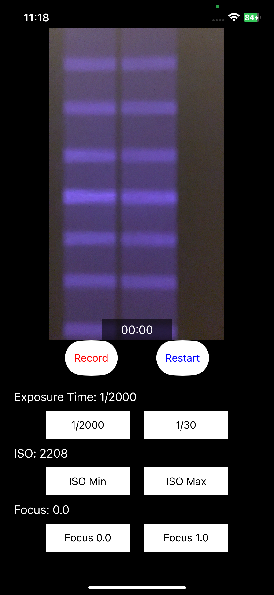
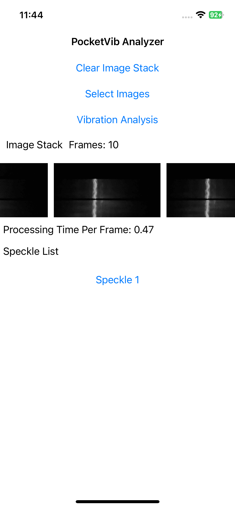
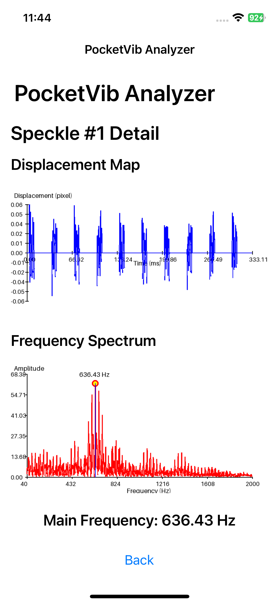

# When Mobile ToF Meets Micro-Vibration: Multi-Point kHz-Frequency Sensing using Laser Speckle

This repo contains the official code and sample data for our MobiCom 2026 paper. For more details, please see [Project Page](https://shangchengjin.github.io/PocketVib_web/).

## Part 1: PocketVib Algorithm Testing

The notebook [`./PocketVib_Algorithm/PocketVib.ipynb`](./PocketVib_Algorithm/PocketVib.ipynb) demonstrates how PocketVib extracts vibration signals from captured laser speckle images.  

We provide sample data in [`./sample_data`](./sample_data) for users to explore the algorithm and reproduce results.  
**Ground truth vibration frequency**: 637.6 Hz.

---

## Part 2: PocketVib App for On-Device Vibration Analysis

A demo video of PocketVib in action is available [here](https://youtu.be/4D6ri728UfQ).

### 📲 Getting the PocketVib Collector Running

The source code is partially derived from:

- [Apple AVFoundation LiDAR Documentation](https://developer.apple.com/documentation/avfoundation/capturing-depth-using-the-lidar-camera/)
- [Apple AVFoundation MultiCam](https://developer.apple.com/documentation/avfoundation/avmulticampip-capturing-from-multiple-cameras/)

#### Setup Instructions:
1. Open the Xcode project file `./PocketVib_App/PocketVib_Collector/PocketVib_Collector.xcodeproj` in **Xcode 18** (or compatible version).
2. In the project settings, go to **Signing & Capabilities**:
   - Enable **Automatically manage signing**.
   - Select your development team (you’ll need an [Apple Developer Account](https://developer.apple.com/)).
3. Connect your iOS device (e.g., iPhone 12 Pro), trust it, and select it as the build target in Xcode.
4. Click **Run (▶️)** to build and deploy the app. The PocketVib Collector icon will appear on your device.
5. Since this is a non-App Store app, go to **Settings → General → VPN & Device Management** (path may vary by iOS version) and **trust your developer profile**.
6. Launch the app to begin capturing speckle videos.

#### Using the PocketVib Collector
- Use the buttons to adjust **exposure time**, **ISO**, and **focus**.
- Recording runs at ~30 fps.
- Upon successful capture, a `.mov` file is saved to your **Photos library** in an album named after the video.
- The app also **automatically converts** the `.mov` into a sequence of `.png` frames stored in the same album.
- Tap **“Restart”** to reset the App.
<div align="center">
    &nbsp;&nbsp;&nbsp;&nbsp;&nbsp;&nbsp;&nbsp;&nbsp;&nbsp;&nbsp;
    
</div>

---

### 📊 Getting the PocketVib Analyzer Running

The **PocketVib Analyzer** is a native mobile app built with the [BeeWare](https://beeware.org/) framework, enabling Python-based on-device vibration analysis. You can also use AirDrop to transfer images to your PC and analyze them using the Jupyter Notebook [`./PocketVib_Algorithm/PocketVib.ipynb`](./PocketVib_Algorithm/PocketVib.ipynb).

#### Installation:
Follow the **same deployment steps** as the Collector (Xcode build + device trust).

#### Using the PocketVib Analyzer

1. Select `.png` speckle image sequences from your **photo library**.
2. Tap **“Vibration Analysis”** to process the images.
3. The app outputs **vibration frequency estimates** for each speckle region.
4. [**Sample data**](./sample_data) is provided—save the test images to your photo library before use.
<div align="center">
  &nbsp;&nbsp;&nbsp;&nbsp;&nbsp;&nbsp;&nbsp;&nbsp;&nbsp;&nbsp;
  
</div>

---

## 🔗Citation

If you find our work and this codebase helpful, please consider starring this repo 🌟 and cite:

<!--```bibtex-->
<!--@inproceedings{jin2026mobile,-->
<!--  author = {Jin, Shangcheng and Xie, Zhiyuan and Xing, Guoliang and Yan, Zhenyu},-->
<!--  title = {When Mobile {ToF} Meets Micro-Vibration: Multi-Point k{H}z-Frequency Sensing using Laser Speckle},-->
<!--  booktitle = {Proceedings of the Annual International Conference on Mobile Computing and Networking (MobiCom)},-->
<!--  year = {2026},-->
<!--  publisher = {ACM}-->
<!--}-->
<!--```-->
